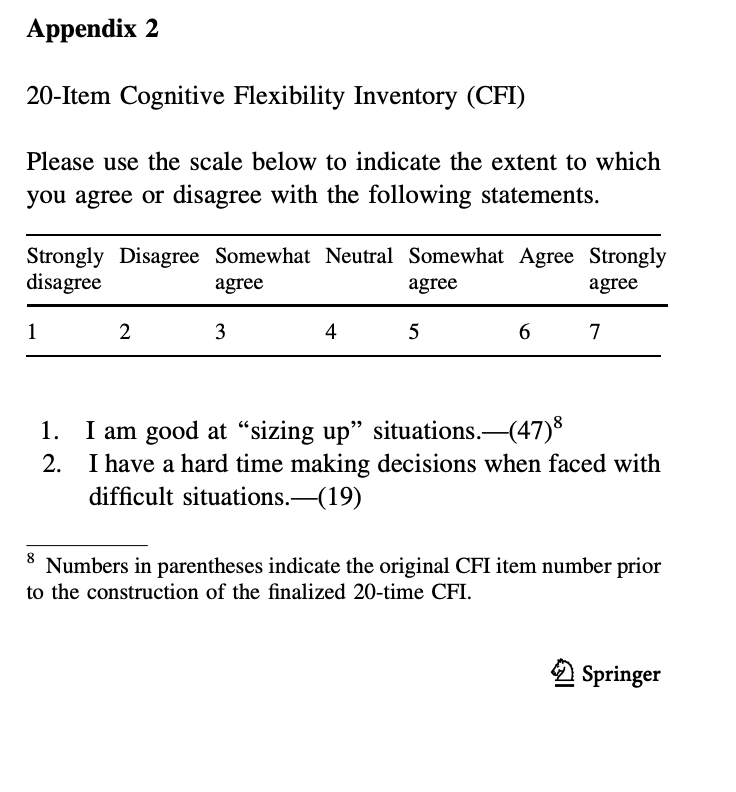
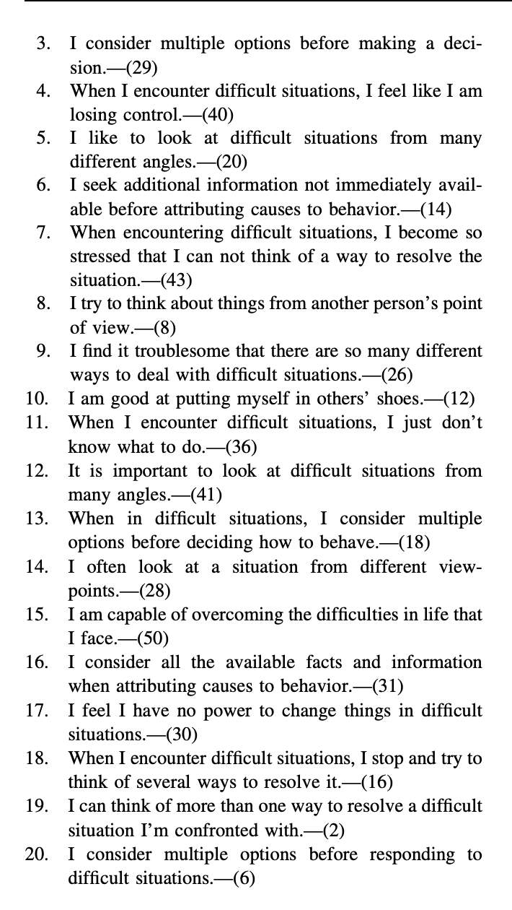

# Cognitive Flexibility Inventory (CFI)

## Overview

The Cognitive Flexibility Inventory (CFI) is a psychological instrument that measures an individual's cognitive flexibility and adaptability in difficult situations.

## Task Description

Participants respond to 20 statements on a 7-point Likert scale ranging from "Strongly Disagree" to "Strongly Agree". The inventory assesses ability to:

- Analyze situations and identify requirements
- Make decisions under difficult circumstances
- Consider multiple perspectives
- Cope with challenging situations
- Think flexibly about problems

## Data Output

### Example Data

See [CFI example output](../assets/data_examples/cfi_example.json) for a complete data sample.

### Key Variables

- **response**: Object containing participant responses (Q0-Q15)
- **question_order**: Array of question order
- **likert_scale**: 7-point scale labels used
- **rt**: Response time in milliseconds
- **trial_id**: Identifies survey trial type

### Scoring

Responses are coded 0-6 corresponding to the 7-point Likert scale. Higher scores indicate greater cognitive flexibility.

## Task Screenshot

See [Dennis & Vander Wal, 2010](https://rdcu.be/ezGts)

## Preview

Try the task online: [CFI Preview](https://deploy.expfactory.org/preview/72/)
