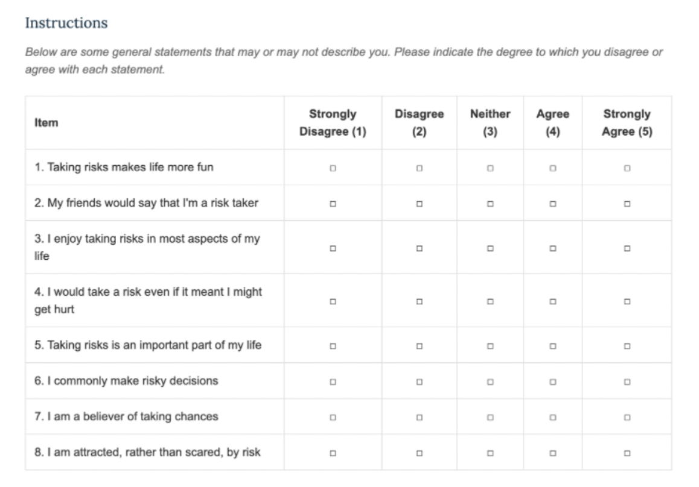

# General Risk Propensity Scale (GRIPS)

## Overview

The General Risk Propensity Scale (GRIPS) is a psychological measure assessing an individual's general tendency toward risk-taking behavior across various life domains.

## Task Description

Participants respond to 8 statements about risk-taking attitudes and behaviors on a 5-point Likert scale ranging from "Strongly Disagree" to "Strongly Agree". The scale measures:

- Enjoyment of risk-taking
- Risk-seeking in decision making
- Attraction to risky situations
- General risk propensity attitudes

## Data Output

### Example Data

See [GRIPS example output](../assets/data_examples/grips_example.json) for a complete data sample.

### Key Variables

- **response**: Object containing participant responses (Q0-Q7)
- **question_order**: Array showing randomization order of questions
- **likert_scale**: 5-point scale labels used
- **rt**: Response time in milliseconds
- **trial_id**: Identifies survey trial type

### Scoring

Responses are coded 0-4 corresponding to the 5-point Likert scale. Higher scores indicate greater risk propensity.

## Task Screenshot

## Preview

Try the task online: [GRIPS Preview](https://deploy.expfactory.org/preview/74/)
