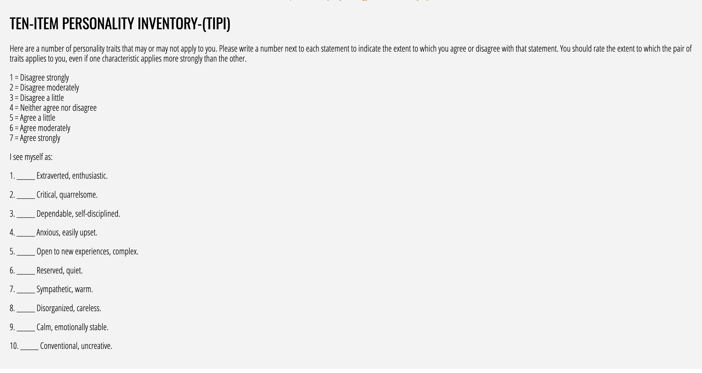

# Ten Item Personality Inventory (TIPI)

## Overview

The Ten Item Personality Inventory (TIPI) is a brief measure of the Big Five personality dimensions, providing a quick assessment of personality traits.

## Task Description

Participants rate themselves on 10 personality descriptors using a 7-point scale from "Disagree strongly" to "Agree strongly". The inventory measures the Big Five personality factors:

- **Extraversion** (items 1, 6R)
- **Agreeableness** (items 2R, 7)
- **Conscientiousness** (items 3, 8R)
- **Neuroticism** (items 4R, 9)
- **Openness** (items 5, 10R)

_Note: R indicates reverse-scored items_

## Data Output

### Example Data

See [TIPI example output](../assets/data_examples/ten_item_personality_example.json) for a complete data sample.

### Key Variables

- **response**: Object containing participant responses (Q0-Q9)
- **question_order**: Array of question order
- **likert_scale**: 7-point scale labels used
- **rt**: Response time in milliseconds
- **trial_id**: Identifies survey trial type

### Scoring

Responses are coded 0-6 corresponding to the 7-point Likert scale. Items 2, 4, 6, 8, and 10 should be reverse-scored before computing dimension scores.

## Task Screenshot

## Preview

Try the task online: [TIPI Preview](https://deploy.expfactory.org/preview/77/)
